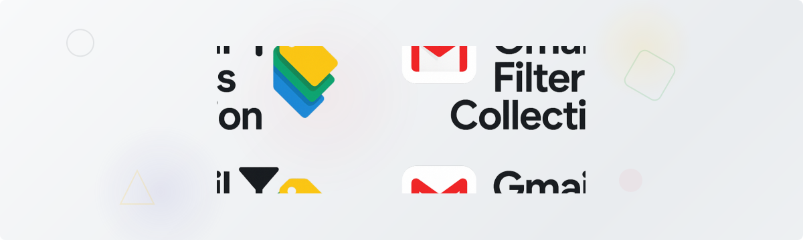

<div align="center">
  

[](https://opensource.org/licenses/MIT)
[](https://gmail.com)
[]()
[]()
[]()
[]()
[]()

**Ready-to-use Gmail filter packages that automatically organize your inbox**

*Choose the package that fits your needs and get organized in minutes*

<!-- ### 🌐 [**Visit Our Website**](https://pralhad-nasane.github.io/gmail-filters-collection/) | 📖 [**Complete Guide**](COMPLETE_GMAIL_FILTER_GUIDE.md) -->

</div>

## Repository Structure

```
gmail-filters-collection/
├── README.md                    
└── filters/
    ├── basic-user/
    │   ├── basic_user_filters.xml
    │   └── README.md
    ├── business-professional/
    │   ├── business_professional_filters.xml
    │   └── README.md
    ├── student/
    │   ├── student_filters.xml
    │   └── README.md
    ├── youtuber-developer/
    │   ├── youtuber_developer_filters.xml
    │   └── README.md
    ├── freelancer-entrepreneur/
    │   ├── freelancer_entrepreneur_filters.xml
    │   └── README.md
    ├── parent-family/
    │   ├── parent_family_filters.xml
    │   └── README.md
    ├── senior-retiree/
    │   ├── senior_retiree_filters.xml
    │   └── README.md
    └── ecommerce-seller/
        ├── ecommerce_seller_filters.xml
        └── README.md
```

## Features

| Feature | Benefit |
|---------|---------|
| **Automatic email sorting** | No more manual organization |
| **Important emails marked** | Never miss what matters |
| **Spam protection** | Financial emails stay safe |
| **Clean inbox** | Less clutter, more focus |
| **Cross-platform compatibility** | Works on phone and computer |

## 📦 Available Packages

<table>
<tr>
<td width="50%">

### [Basic User](filters/basic-user/)
**Perfect for:** Regular email users

**What it organizes:**
- Social media notifications
- Online shopping orders  
- Streaming subscriptions
- Travel bookings
- Financial emails

</td>
<td width="50%">

### [Business Professional](filters/business-professional/)
**Perfect for:** Business owners, employees, freelancers

**What it organizes:**
- Client emails (marked as important)
- Meeting invitations
- Payments and invoices
- Project updates
- Legal documents

</td>
</tr>
<tr>
<td width="50%">

### [Student](filters/student/)
**Perfect for:** College and university students

**What it organizes:**
- School emails (.edu addresses)
- Class assignments and grades
- Financial aid information
- Job applications
- Campus activities

</td>
<td width="50%">

### [YouTuber & Developer](filters/youtuber-developer/)
**Perfect for:** Content creators and programmers

**What it organizes:**
- YouTube notifications
- GitHub and coding platforms
- Creative tools (Figma, Adobe)
- Business partnerships
- Tech newsletters

</td>
</tr>
<tr>
<td width="50%">

### [Freelancer & Entrepreneur](filters/freelancer-entrepreneur/)
**Perfect for:** Freelancers, solopreneurs, independent contractors

**What it organizes:**
- Client leads and projects
- Freelance platform notifications
- Payment and invoicing systems
- Networking and referrals
- Skill development

</td>
<td width="50%">

### [Parent & Family](filters/parent-family/)
**Perfect for:** Parents managing family communications

**What it organizes:**
- School communications
- Medical appointments
- Children's activities
- Family shopping
- Emergency alerts

</td>
</tr>
<tr>
<td width="50%">

### [Senior & Retiree](filters/senior-retiree/)
**Perfect for:** Seniors and retirees

**What it organizes:**
- Medicare and healthcare
- Social Security and pensions
- Government communications
- Family updates
- Hobbies and community

</td>
<td width="50%">

### [E-commerce & Online Seller](filters/ecommerce-seller/)
**Perfect for:** Online sellers and e-commerce businesses

**What it organizes:**
- Customer support and reviews
- Platform notifications (Amazon, eBay, Etsy)
- Inventory and suppliers
- Payment processing
- Marketing and analytics

</td>
</tr>
</table>

## 🚀 Installation

**Quick Setup - Takes just 2 minutes**

1. **Pick your package** from the list above
2. **Go to that folder** and download the XML file  
3. **Open Gmail** → Settings → "Filters and Blocked Addresses"
4. **Click "Import filters"** → Choose your downloaded file
5. **Review and create** → Done!

## Why Use These Filters?

| **Benefit** | **Result** |
|-------------|------------|
| **Save time** | No more manual email sorting |
| **Stay organized** | Everything has its place |
| **Never miss important emails** | Auto-marked for priority |
| **Less stress** | Clean, organized inbox |
| **Easy setup** | Ready in just a few minutes |

## Need Help?
- Read the README in each package folder for detailed setup instructions
- Open an issue if something doesn't work as expected

## Can I Customize?

Yes! These filters are starting points. You can:
- Add more email addresses or keywords
- Change label names
- Combine filters from different packages
- Turn off rules you don't need

### Adding Your Own Filter

Want to add a new service or category? Here's the template:

```xml
<!-- YOUR SERVICE: Detailed description of what this filter captures -->
<entry>
  <category term='filter'/>
  <title>Your Service Name</title>
  <updated>2025-09-07T00:00:00Z</updated>
  <content/>
  <apps:property name='from' value='example.com OR service.com'/>
  <apps:property name='hasTheWord' value='subject:(keyword1 OR keyword2 OR "exact phrase")'/>
  <apps:property name='label' value='YourCategory/YourService'/>
  <apps:property name='shouldNeverSpam' value='true'/>
</entry>
```

### Example: Adding Discord

```xml
<!-- SOCIAL: Discord server and messaging notifications -->
<entry>
  <category term='filter'/>
  <title>Social - Discord</title>
  <updated>2025-09-07T00:00:00Z</updated>
  <content/>
  <apps:property name='from' value='discord.com OR discordapp.com'/>
  <apps:property name='hasTheWord' value='subject:(server OR guild OR message OR mention)'/>
  <apps:property name='label' value='Social/Discord'/>
  <apps:property name='shouldArchive' value='true'/>
</entry>
```

### Common Properties

- `from` - Filter by sender email domain
- `hasTheWord` - Filter by subject line keywords
- `label` - Where to organize the email
- `shouldAlwaysMarkImportant` - Mark as important
- `shouldStar` - Add star to email
- `shouldArchive` - Skip inbox, go straight to label
- `shouldNeverSpam` - Never mark as spam

## Contributing & Suggestions

We'd love to hear from you! If you have:

- **Ideas for new filter packages** (e.g., specific professions, hobbies, or use cases)
- **Improvements to existing filters** (missing services, better organization)
- **Issues or bugs** you've encountered
- **Documentation improvements** or clearer instructions

**How to contribute:**
- 🐛 **[Report a Bug](../../issues/new?assignees=&labels=bug&template=bug_report.yml)** - Found an issue with existing filters?
- 💡 **[Suggest New Package](../../issues/new?assignees=&labels=enhancement%2Cnew-package&template=new_package.yml)** - Have an idea for a new demographic?
- 🔧 **[Improve Filters](../../issues/new?assignees=&labels=enhancement%2Cimprovement&template=improvement.yml)** - Want to enhance existing packages?

Your contributions help make Gmail organization better for everyone!

## License

Free to use and modify. See [LICENSE](LICENSE) for details.

**⭐ Star this repository if it helped organize your Gmail!**
